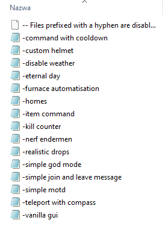

# Podstawy pisania skryptów

Witaj, w tym poradniku przedstawie Ci podstawy pisania skryptów. Jeżeli potrzebujesz pomocy, napisz do mnie na discord `JorgiTV#0177` Jeżeli uważasz, że nie ma w poradniku jakieś ważnej funkcji? Napisz do mnie, a ja postaram się ją dodać! **PORADNIK JEST W WERSJI ROBOCZEJ**

## Spis treści
* [Wprowadzenie do Skript'a](#wprowadzenie_do_skript)
* [Co zrobić aby, zacząć pisać skrypty?](#co_zrobic_aby_zaczac)
* [Podstawowe komendy pluginu Skript](#podstawowe_komendy)
* [Jak stworzyć swój pierwszy skrypt?](#jak_stworzyc_skrypt)
* [Podstawowe funkcje komendy](#podstawowe_funkcje)
* [Czym jest argument?](#czym_jest_argument)
* [Rodzaje argumentów](#rodzaje_argumentow)
* [Czym jest if oraz else?](#if_oraz_else)
* [Czym są zmienne?](#czym_sa_zmienne)

## <a name="wprowadzenie_do_skript">Wprowadzenie do Skript'a</a>
Skript jest dobry dla początkujących osób. Jest on alternatywą języka Java, którego w minecraft'cie wykorzystujemy m. in. do pisania pluginów. Całą dokumentację Skripta znajdziesz **[tutaj](https://skriptlang.github.io/Skript/index.html)**. Przydatna w pisaniu skryptów jest znajomość języka angielskiego. Podczas pisania skryptów używa się go praktycznie cały czas. Każdy skrypt zapisywany jest w formacie `.sk`, a następnie jest on czytany przez język Java. Niestety, skrypty nie są tak wydajne jak pluginy, dlatego większość nie zaleca ich używania. Jednakże, sądzę, że skrypty są dobrym rozwiązaniem na początek przygody z "programowaniem".

## <a name="co_zrobic_aby_zaczac">Co zrobić aby, zacząć pisać skrypty?</a>
Aby zacząć pisać skrypty, należy zaopatrzeć się w odpowiedni program. Możesz używać domyślnego notatnika, lecz na dłuższy czas, nie będzie on wygodny. Najwygodniejszym programem do pisania na początek jest **[SkIDE](https://skide.liz3.net/)**. Jest on programem, które oferuje podświetlanie składni skrypta, oraz automatyczne uzupełnianie. Program pozwala również dodawanie dodatków zarejestrowanych w **Skript Hub**. Możesz również użyć innego zamiennika np. **[NotePad++](https://notepad-plus-plus.org/downloads/)**. Zalecane jest również wybranie systemu kodowania **UTF-8**, tak aby wszystko zapisałby się poprawnie.

Aby zacząć swoją przygodę z pisaniem skryptów, należy pobrać odpowiednią wersję pluginu **[Skript](https://github.com/SkriptLang/Skript/releases)** oraz następnie wrzucić go do folderu `/plugins/` i zrestartować serwer. Po włączeniu serwera, powinien stworzyć się folder `/Skript/`, wejdź do niego a następnie przejdź do folderu `/scripts/`. W tym folderze powinny znajdować się pliki ukazane na *(Zdjęcie 1)*. Nie przydadzą Ci się one, więc możesz je usunąć.



## <a name="podstawowe_komendy">Podstawowe komendy pluginu Skript</a>
- `/sk reload [all/(nazwa pliku)]` - Przeładowuje pliki twojego danego skryptu, lub wszystkie dostępnych na twoim serwerze (W przypadku posiadania większej ilości skryptów, zalecane jest przeładowywanie ich pojedyńczo). Załóżmy, że posiadasz skrypt o nazwie `test.sk`, aby go przeładować użyjesz komendy `/sk reload test` lub `/sk reload test.sk`

- `/sk disable (nazwa pliku)` - Pozwala wyłączyć dany skrypt, jeżeli jest on włączony. Dzięki tej funkcji, można wyłączyć tymczasowo dany skrypt w tym jego wszyskie funkcje.

- `/sk enable (nazwa pliku)` - Pozwala włączyć dany skrypt, jeżeli jest on wyłączony. Aby rozpoznać, czy skrypt jest wyłączony z poziomu plików, należy zobaczyć czy posiada przed swoją nazwą `-` przykładowo `-test.sk`. Jeżeli prawidłowo wpiszesz komende `-` powinien zniknąć, a nazwa powinna wyglądać tak: `test.sk`

## <a name="jak_stworzyc_skrypt">Jak stworzyć swój pierwszy skrypt?</a>
Aby stworzyć swój pierwszy skrypt należy w ścieżce `/plugins/Skript/scripts` stworzyć plik o nazwie i rozszerzeniu `twojanazwa.sk`, a nastepnie wejść do niego. Najważniejszą informacją, którą zawsze musisz pamiętać, to poprawne **TAB'owanie** skryptu. Jest ono niezbędne podczas pisania. Możesz użyć również **4 spacji = TAB** lecz nie jest to wygodne. Przejdźmy już do docelowego pisania skryptu, który będzie wyglądał tak:

```java
command /test:
  trigger:
    send "Hello world!"
```

Zastanwiasz się co do czego służy? Już to tłumacze:

* **command**: Jest to główna struktura, dzięki niej możesz stworzyć swoją własną komendę
* **trigger**: Jest on wyznacznikiem dla kodu, po którym zaczyna sie jego działanie
* **send**: Funkcja wysyłania wiadomości na chacie, jej treść musi znajdować się w ""

Gratulacje! Napisałeś swój pierwszy skrypt! Efekt finalny po zapisaniu skryptu `Ctrl + S`, przeładowaniu go komendą `/sk reload nazwaskryptu` oraz wpisaniu komendy `/test` prezentuje się tak:


## <a name="podstawowe_funkcje">Podstawowe funkcje komendy</a>
Jeżeli stworzyłeś już swoją pierwszą komendę, warto jest zapoznać się z przydatnymi funkcjami, które są widoczne poniżej:

```java
command /test:
  aliases: pierwszakomenda, pa
  permission: twoja.permisja
  permission message: "Komunikat informujący o tym, że gracz nie ma permisji"
  trigger:
    send "Hello world!"
```

* **aliases**: Dzięki tej funkcji, możesz uzyskać dodatkowe komendy z tą samą funkcji, bez konieczności powielania jej.
* **permission**: Funkcja ta, pozwala ustawić permisje do twojej komendy
* **permission message**: Pozwala ustawić wiadomość, dotyczącą o braku permisji do danej komendy

## <a name="czym_jest_argument">Czym jest argument?</a>
Argument to treść wpisywana po twojej komendzie. Przykładowo:
* Komenda z argumentem `/test tresc1`
* W tym przypadku `tresc1` jest twoim `arg 1 (Pierwszym argumentem)`

Taka sama sytuacja będzie przy komendzie `/test tresc1 tresc2 tresc3`:
* W tym przypadku `tresc1, tresc2, tresc3` jest twoim `arg 1, arg 2, arg3 (Pierwszym, drugim, trzecim argumentem)`

A więc prztestujemy to w praktyce. Aby wprowadzić argument do komendy, należy dodać `[<text>]`:

```java
command /test [<text>]:
  trigger:
    send "Hello world!"
```

Forma `[<text>]` nie jest jedynym argumentem, jest ich wiele co postaram się przedstawić w wątku niżej.

## <a name="rodzaje_argumentow">Rodzaje argumentów</a>
Argumentów do wykorzystania w komendzie jest wiele, postaram Ci się przedstawić najbardziej przydatne:
* `[<text>]`: Jest on argumentem tekstowym. Najbardziej uniwersalny argument jakiego można użyć w komendzie.
* `[<player>]`: Argument ten przeznaczony jest dla nicków graczy którzy są online.
* `[<integer>]`: Wykorzystywany jest do komend, które korzystają z liczb całkowitych

## <a name="if_oraz_else">Czym jest `if` oraz `else`?</a>
Wiele osób, które zaczynają swoją przygode z pisaniem skryptów, ma problem ze zrozumieniem, czym jest `if` oraz `else`. Postaram się to wyjaśnić poniżej:
* `if`: Jest to w dosłownym tłumaczeniu na Polski **jeśli**. Domyślnie sprawdza czy dana wartość, zmienna itp. są `true` czy `false`
* `else`: Jest przeciwieństwem `if`. Jego dosłowne tłumaczenie to **w przeciwnym razie**. Wykonuje się, jeżeli wartość `if` nie jest uzupełniona, lub gdy ustawiona jest na `false`

Przykład wykorzystania wraz z użyciem argumentu:

```java
command /test [<text>]:
  trigger:
    if arg 1 is set:
      send "Uzupełniono pierwszy argument"
    else:
      send "Nie uzupełniono pierwszego argumentu!"
```

## <a name="czym_sa_zmienne">Czym są zmienne?</a>
Zmienne to forma zapisywania danych. W skrypcie istnieje forma zmiennych:

* **Zmianna globalna:** `{twojazmienna}` (Zmienne te zapisywane są w pliku `variables.csv` przez co, po restarcie serwera, dane nie zostaną utracone)
* **Zmianna tymczasowa:** `{_twojazmienna}` (Te zmienne po zakończeniu polecenia zostają usuwane)
* **Zmienna grupowa:** `{twojazmienna::*}` (W tej zmiennej możesz przechowywać listy takie jak: lista graczy, przedmiotów itp.)

Zmienne możesz odzielać symbolem `.` przykład `{twojazmienna.%player%}`, lecz zalecane używanie jest `{twojazmienna::%player%}`
Jeżeli chcesz użyć zmiennej w skrypcie, wystarczy wpisać twoją zmienną w `%%` przykład `%{twojazmienna}%`

```java
variables:
  {twojazmienna} = true
  
command /test:
  trigger:
    send "%{twojazmienna}%"
```

**PORADNIK JEST W WERSJI ROBOCZEJ!**
